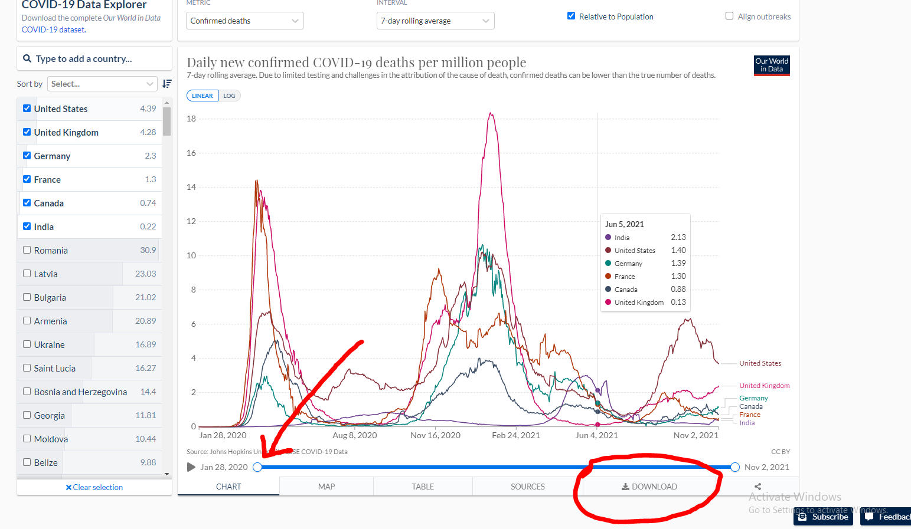

# COVID Data Exploration: Project Overview

To download the data for yourself, follow [this link](https://ourworldindata.org/covid-deaths) and scroll to the bottom. Drag the slider to the very left until
Jan 28, 2020 is selected and then click the "DOWNLOAD" button at the bottom right.

I then subsected the data in excel to create
the CovidDeaths.csv and CovidVaccinations.csv files used in the analysis.

